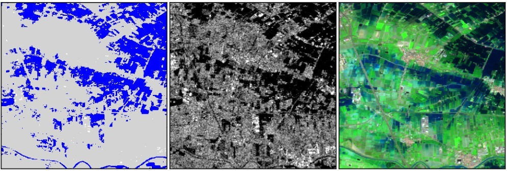

# Flood Model



Flood Model is a neural network used to perform image segmentation to detect flood areas.

## Getting started
 
## Tutorial

If you want to try using this model, follow our tutorial to train the model on a dataset.

## Development
### Setup environment

First, clone the repository
```bash
git clone git@gitlab.develop.eoepca.org:sharinghub-test/flood-model.git
```

Then clone the dataset repository into the flood-model project
```bash
cd flood-model
git clone git@gitlab.develop.eoepca.org:sharinghub-test/sen1floods11-dataset.git
```

Configure dvc, then pull the dataset with dvc
```bash
cd sen1floods11-dataset
dvc pull
cd ..
```

You can setup your python environnment using poetry

```bash
poetry install --no-root
```

Do not forget to setup mlflow authentication
Then you can run a train with poetry

```bash
poetry run python3 src/train.py
```

Your can also run an inference with a pre-trained model

```bash
poetry run python3 src/inference.py <model_path> <input_path>
```
